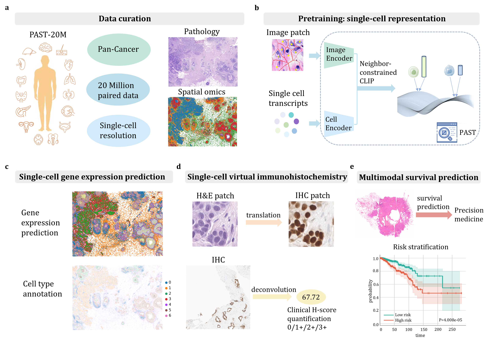

# Single-cell resolution with pan-cancer generalization in morpho-molecular foundation modeling from histopathology with PAST

[](LICENSE)
[](https://arxiv.org/pdf/2507.06418)
[](https://huggingface.co/Boyoungc/CHROMA_pretrain/tree/main)

---



**PAST** (Pathology And Single-cell Transcriptomics) is a foundation model that jointly integrates histopathology images and single-cell transcriptomes at unprecedented scale and resolution. Unlike traditional pathology foundation models that rely solely on morphological features, PAST learns unified cross-modal representations capturing both spatial and molecular heterogeneity at the cellular level.


---

## 📝 Key Features

- Single-cell Resolution: First model to integrate 20 million paired histopathology images and single-cell transcriptomes
- Pan-cancer Coverage: Trained across 15 distinct tumor types with robust cross-cancer generalization
- Single-cell gene expression prediction from H&E slides
- Virtual immunohistochemistry with quantitative H-Score readouts
- Enhanced multimodal survival prediction

---

## 🎉 News

- 2025/10: Initial code and weights released!

---

## 🔧 Installation

### Create Environment

```bash
# Clone the repository
git clone https://github.com/your-username/PAST.git
cd PAST

# Create conda environment
conda create -n past python=3.11
conda activate past

# Install dependencies
pip install -r requirements.txt
```

---

## 🚀 Pre-trained Models

Model	Weights Link	Description

[PAST-pretrain](https://huggingface.co/Boyoungc/PAST/blob/main/checkpoint-context300.pth)

---

## 🧑‍💻 Quick Start

```python
import torch
import os

# Download checkpoint from Hugging Face
# https://huggingface.co/Boyoungc/PAST/blob/main/checkpoint-context300.pth

# Load the pretrained weights
checkpoint_path = "checkpoint-context300.pth"
state_dict = torch.load(checkpoint_path, map_location="cpu")["model"]

# Extract image encoder weights (for pathology images)
image_encoder_weights = {
    k.replace("image_encoder.model.", ""): v 
    for k, v in state_dict.items() 
    if "image_encoder.model." in k
}

# Extract cell encoder weights (for spatial omics data)
cell_encoder_weights = {
    k.replace("cell_encoder.model.", ""): v 
    for k, v in state_dict.items() 
    if "cell_encoder.model." in k
}

# Load into your model
model.image_encoder.load_state_dict(image_encoder_weights, strict=False)
model.cell_encoder.load_state_dict(cell_encoder_weights, strict=False)
```

## Extract Image Features from H&E Patches

```python
from PIL import Image
import torchvision.transforms as transforms

# Load and preprocess image
transform = transforms.Compose([
    transforms.Resize(224),
    transforms.CenterCrop(224),
    transforms.ToTensor(),
    transforms.Normalize(mean=[0.485, 0.456, 0.406], 
                       std=[0.229, 0.224, 0.225])
])

image = Image.open("cell_patch.png")
image_tensor = transform(image).unsqueeze(0)

# Extract features
with torch.no_grad():
    image_features = model.image_encoder(image_tensor)
    
print(f"Image feature shape: {image_features.shape}")
```


## 🏋️‍♂️ Pretraining PAST from Scratch

To pretrain PAST, use the following command (example for 8 GPUs):

```python
torchrun --nproc_per_node=8 --master_port=48798 \
    PAST_train.py \
    --exp_name 'past_pretraining' \
    --batch_size 48 \
    --num_workers 16 \
    --save_interval 10000 \
    --accum_iter 5 \
    --distributed True \
    --output_dir ./output_dir_context300 \
    --log_dir ./output_dir_context300

```

Change --nproc_per_node based on the number of GPUs you have.


---

## 📄 Citation

If you use PAST, please cite:

```python
@article{yang2025past,
  title={Past: A multimodal single-cell foundation model for histopathology and spatial transcriptomics in cancer},
  author={Yang, Changchun and Li, Haoyang and Wu, Yushuai and Zhang, Yilan and Jiao, Yifeng and Zhang, Yu and Huang, Rihan and Cheng, Yuan and Qi, Yuan and Guo, Xin and others},
  journal={arXiv preprint arXiv:2507.06418},
  year={2025}
}
```

---

## 📮 Contact

For questions or collaborations, please contact:

changchun.yang@kaust.edu.sa
